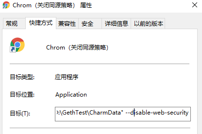
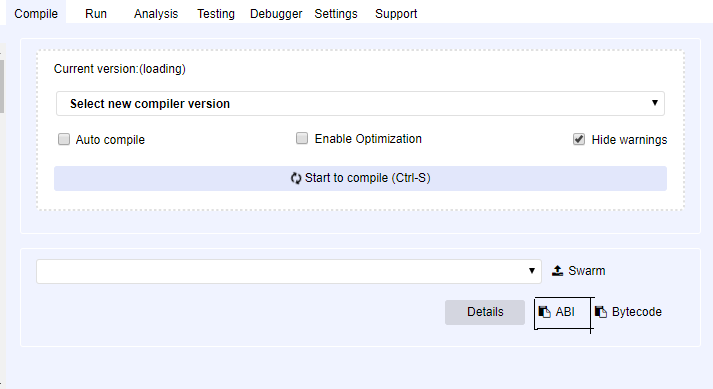
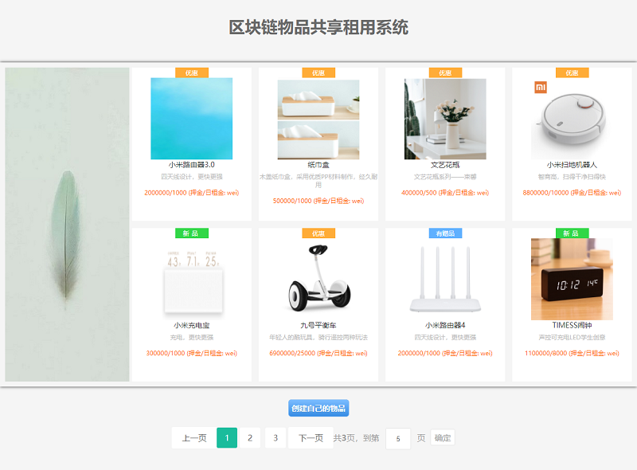
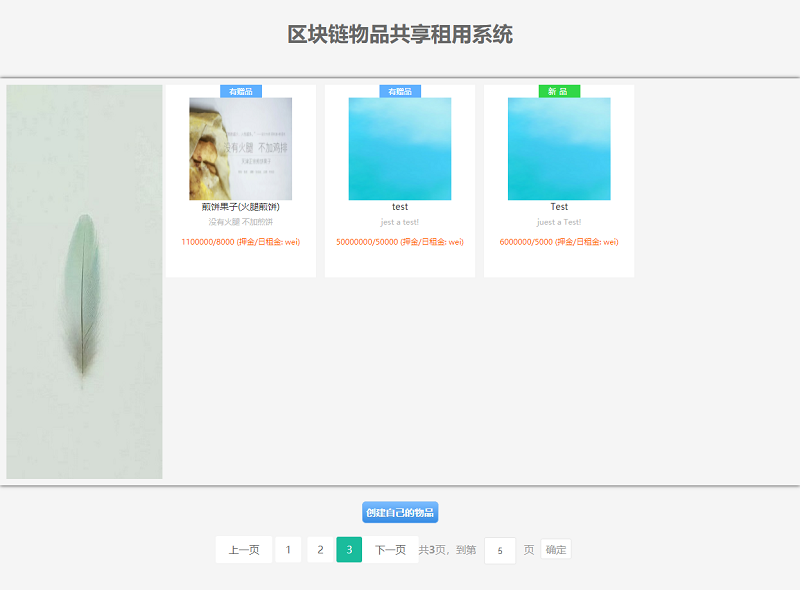
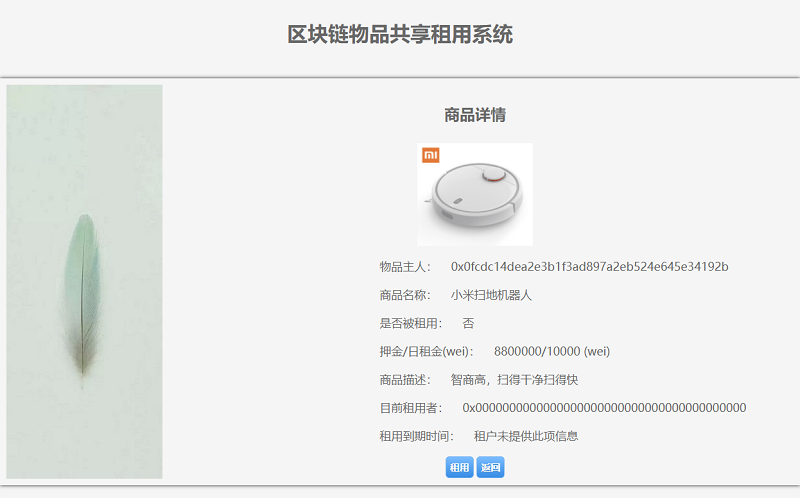
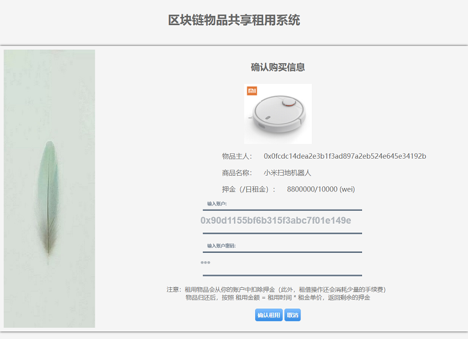
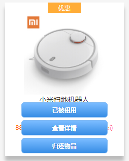
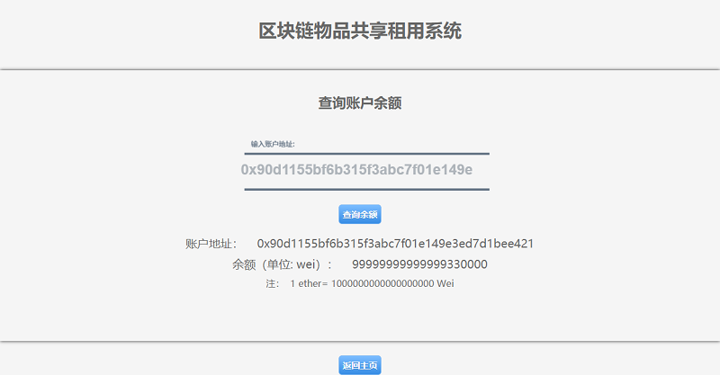
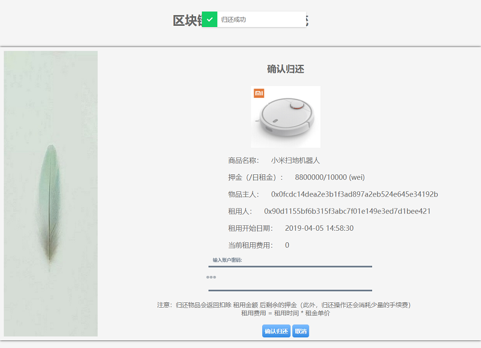

# BlockChainrent 说明   
系统使用以太坊 geth 客户端，在默认的项目中有一个block的geth区块链数据文件夹，可以直接用此文夹启动geth客户端，该区块链数据中默认存放了一些商品信息，和默认申请了四个账号，里面均有余额：    

*  defoultAccount = "0x0fcdc14dea2e3b1f3ad897a2eb524e645e34192b";
*  acc1 = "0xf71a914d2d108506ab4c66441964a894650b0c5b"; 
*  acc2 = "0x90d1155bf6b315f3abc7f01e149e3ed7d1bee421";
*  acc3 = "0x322fc04c646cc71707a997dc99f7732654449ba6";
*  pass = '123';      

其中defoultAccount账号是geth开发者模式下自动生成的账号，不用密码，其余三个账号密码是 123  ，账号acc3 在开发时用作了一个中间账号，系统中不使用，其中两个账号可以用来测试租借，当然，你可以申请新的账号，新申请的账号没有余额，需要转账到里面才可使用。      

当然你也可以用一个新的数据文件启动geth，则数据中将不含任何商品信息，需要新创建。    

## 使用说明   
首先打开cmd ,开启 geth,如果使用上面的数据文件，进入项目目录下，则可以用下面的命令启动geth，应用中使用的RPC端口为8545,如有变更，则应对应修改应用中和geth建立链接的部分代码（App.js  initWeb3）：   
`geth --datadir \blockdata --rpc --dev --rpcapi "db,web3,eth,net,personal" --rpccorsdomain " *" console 2>> \test.log`      

#### 注意： 
应用中jQuery代码在浏览器中运行的时候，CORS(CrossOrigin Resources Sharing，跨源资源共享）可能会受到同源策略的限制，导致执行不成功,在本地开发测试的时候可以参考下面的方法暂时关闭浏览器（Google Chrome）的同源策略以便执行程序（平时的浏览器不建议关闭同源策略，这样做可能会导致你收到一些攻击，例如CSRF(跨站请求伪造攻击)，可自行查询CORS和同源策略的相关知识）   
通过以下命令启动（Google Chrome）浏览器，同时关闭同源策略   
``` 
chrome.exe --allow-file-access-from-files --user-data-dir="D:\GethTest\CharmData" --disable-web-security
``` 
为了方便，可以为谷歌浏览器新建一个关闭同源策略启动的快捷方式，同时新建一个数据文件，区别于正常使用的goole charm。在新建的快捷方式的目标中加入上面参数即可。     

         


其中项目下的各个文件夹说明如下:       
 
   

应用中主要用到的是blockdata问价夹和src文件夹   
    
* blockdata是区块链的数据文件和账户的密钥文件，其中已经部署了合约和初始化了一些数据(使用defoultAccount账号创建的，不能用创建者的账号租用物品)，geth启动时，数据目录参数需要用此目录。     
* cintracts 中存放了Solidity编写的智能合约，ShareApp.sol.   
* src主要存放项目源文件，src中文件说明如下:   

    
 
* contracts 中shareapp.json中存放了编译好后智能合约的ABI和部署后的合约地址   
* JS中的app.js是整个项目的JS代码，整个项目的执行逻辑都在其中   
* html为项目的前端文件 (mian.html是项目的入口，首页)，ethTest.html只是一个测试页面，getMoney.htmlk可以方便查询当前区块链中拥有账户的余额。(新增REgister.hteml方便注册区块链账号)   
* good.json是初始化项目的一些商品数据。   
* shareApp.sol是当前使用的智能合约代码。（移动至上一层contracts文件夹中）     


首先，需要编译智能合约代码（合约变更后），然后部署到geth中（合约变更后），同时将编译后合约的ABI,以及部署地址重新粘贴contracts 中shareapp.json文件中，当使用默认的blockdata目录启动时，该目录中已经存放部署过了合约，就不用在编译部署了。    
     
如果变更 重新编译部署了合约，你需要改变的是：      
1、  在remix-IDE中成功编译后，复制ABI粘贴到src\contracts\sharwApp.json中对应的abi 后面，   

   

2、 部署合约后，将合约地址复制粘贴到src\contracts\sharwApp.json中对应的address 后面：   


## 使用测试   

如果合约未变更，并且使用blockdata目录正确启动了geth后，直接用关闭同源策略的浏览器打开main.html后，就可以访问程序了：   

   
  
鼠标移动到物品上后会显示租用查看详情的按钮，底部可以选择创建新的物品:   

   

首先选择创建物品    

    

利用已有的账号`0xf71a914d2d108506ab4c66441964a894650b0c5b`，创建一个新的物品,图片需要将图片放置src\images下:   


创建后提示创建成功后说明创建成功，返回查看，   

   

查看商品详情:   

   

使用账号`0x90d1155bf6b315f3abc7f01e149e3ed7d1bee421`进行租用，在此之前代开getMoney.htmL 先查看一下该账户的余额:    

    

然后租用,会提示输入账号和密码，租用后提示租用成功说明租用已经成功：   

    

返回查看物品，已经租用成功，不可租用：    

    


     

查看账户余额，发生了变化    



接着归还物品，会提示输入密码，确认是租用者，提示归还成功后，说明归还成功   
   

再次查看物品，已经归还成功，可以再次租用：   

   

       
   

***

*联系方式：*    

*博客：[X-Mallory.github.io](https://x-mallory.github.io/)*    

*邮箱：Guoyusu@outlook.com*


